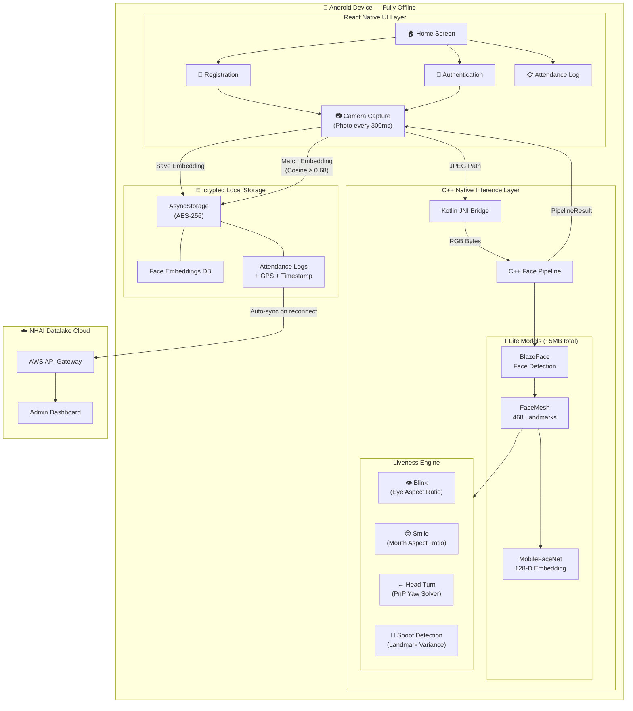
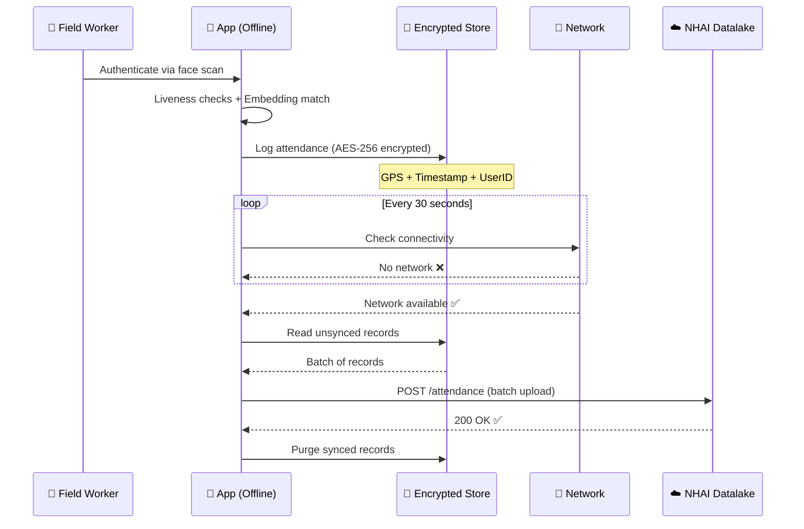

<div align="center">

# 🛡️ NHAI Datalake 3.0 — Edge AI Biometric Attendance

### Offline-First Facial Recognition & Anti-Spoofing for Remote Highway Sites

**Built for NHAI Hackathon 7.0**

[](https://reactnative.dev/)
[](https://www.tensorflow.org/lite)
[](https://expo.dev/)
[](LICENSE)

---

**🎬 [Watch the App Demo](https://drive.google.com/file/d/1fte-xrbEPMz2iTOUFIT03nt96kDRmioC/view?usp=drive_link)**  •  **📱 [Download the APK](https://drive.google.com/file/d/1CBJukTp31zlkzcuH7OM_0KuCoj8KzQkt/view?usp=sharing)**  •  **📊 [View the Pitch Deck](https://docs.google.com/presentation/d/1giaaZAr5_tXwfQ5yQR-oHWWXY-oLNojN/edit?usp=drive_link&ouid=110479525871212307024&rtpof=true&sd=true)**

---

</div>

## 🔍 The Problem

India's highway construction spans some of the most remote, connectivity-dead zones in the country. NHAI field sites face a critical operational challenge:

| Challenge | Impact |
|---|---|
| **Zero Internet Connectivity** | Cloud-dependent attendance systems are completely non-functional at remote sites |
| **Rampant Proxy Attendance** | Traditional biometrics are easily spoofed with photos or videos (buddy-punching) |
| **Biometric Data Exposure** | If a field device is lost or stolen, sensitive biometric data is at risk |
| **High Cloud Costs** | Continuous AWS inference for facial recognition burns budget on every single verification |

> **Bottom line:** NHAI needs an attendance system that works with **zero internet**, defeats **fraud**, keeps data **secure**, and costs **nothing** to run per-verification.

---

## 💡 Our Solution

**DatalakeApp** is a fully offline, on-device AI-powered biometric attendance system that runs entirely on the field supervisor's Android phone — no servers, no internet, no cloud inference.

### How It Works (in 30 seconds)

```
📝 Register  →  Supervisor registers a worker's face (one-time, ~5 seconds)
🔐 Authenticate  →  Worker scans face daily → AI verifies identity + liveness on-device
📋 Log  →  Attendance record saved locally with GPS + timestamp (AES-256 encrypted)
☁️ Sync  →  When phone reaches a connectivity zone, data auto-uploads to NHAI Datalake
```

### ✨ Key Features

- **🧠 100% On-Device AI** — Three TFLite models (BlazeFace + FaceMesh + MobileFaceNet) run via a C++ pipeline directly on the phone's CPU. Zero cloud calls.
- **🚫 Anti-Spoofing Liveness Detection** — Multi-stage challenges (Blink → Smile → Head Turn) using real-time geometric analysis. Photos and videos are detected and rejected.
- **🔒 AES-256 Encrypted Storage** — All face embeddings and attendance logs are encrypted at rest using Android Keystore-backed keys.
- **📡 Smart Offline-First Sync** — Automatic batch upload with exponential backoff when connectivity returns, followed by local data purge.
- **🗺️ GPS-Tagged Attendance** — Every record is stamped with precise location coordinates to prevent off-site fraud.

---

## 🏗️ System Architecture



---

## 🔐 Authentication Flow

The system uses a **4-step pipeline** to verify a worker's identity:

```
┌─────────────────┐     ┌──────────────────┐     ┌─────────────────┐     ┌──────────────────┐
│  1. Face Align   │────▶│  2. Liveness      │────▶│  3. Embedding   │────▶│  4. Attendance   │
│                  │     │     Checks        │     │     Match       │     │     Logged       │
│  User centers    │     │  Blink → Smile    │     │  128-D vector   │     │  Timestamp +     │
│  face in guide   │     │  → Head Turn      │     │  vs stored DB   │     │  GPS saved       │
│                  │     │  (random order)   │     │  (Cosine Sim)   │     │  locally         │
└─────────────────┘     └──────────────────┘     └─────────────────┘     └──────────────────┘
```

### Anti-Spoofing: How We Defeat Proxy Attendance

| Check | Method | What It Detects |
|---|---|---|
| **Blink Detection** | Eye Aspect Ratio (EAR) — monitors vertical/horizontal eye-landmark ratio | Rejects static photos (eyes never blink) |
| **Smile Detection** | Mouth Aspect Ratio (MAR) — measures dynamic lip-corner expansion | Rejects videos with neutral faces |
| **Head Rotation** | 3D Perspective-n-Point (PnP) solver — calculates yaw angle | Rejects flat images (can't rotate in 3D) |
| **Static Media Filter** | Rolling landmark variance over 20 frames | Catches unnaturally still faces (variance ≈ 0) |

> **Key insight:** A real human face is never perfectly still — there are constant micro-movements. Our variance detector exploits this biological fact to catch even high-quality screen replays.

---

## 🧠 The AI Pipeline

Three lightweight, open-source TFLite models run sequentially in a **single C++ pipeline** — no Python, no server, no cloud:

| Model | Purpose | Input | Output | Size |
|---|---|---|---|---|
| **BlazeFace** | Face Detection | 128×128 INT8 | Bounding box + confidence | ~0.1 MB |
| **FaceMesh** | 3D Landmark Mapping | 192×192 float32 | 468 facial landmarks | ~1.2 MB |
| **MobileFaceNet** | Face Recognition | 112×112 float32 | 128-D embedding vector | ~3.0 MB |

### Face Matching — The Math

We convert every face into a **128-dimensional mathematical vector** (an "embedding"). To check if two faces belong to the same person, we compute:

$$\text{Cosine Similarity} = \frac{\vec{A} \cdot \vec{B}}{|\vec{A}| \times |\vec{B}|}$$

- **≥ 0.90** → ✅ Confirmed match
- **0.68 – 0.90** → ⚠️ Potential match (manual review)
- **< 0.68** → ❌ Rejected

> **Privacy by design:** We never store photos or images of faces. Only irreversible 128-D mathematical vectors — a face cannot be reconstructed from these numbers.

---

## 🛠️ Tech Stack

| Layer | Technology | Why |
|---|---|---|
| **Framework** | React Native 0.85 + Expo SDK 56 | Cross-platform (Android focus), rich ecosystem |
| **Language (JS)** | TypeScript | Type safety across the entire codebase |
| **Language (Native)** | C++ + Kotlin (JNI Bridge) | Maximum inference performance, direct TFLite C API access |
| **Camera** | react-native-vision-camera v5 | High-quality photo capture with fine-grained control |
| **ML Inference** | TensorFlow Lite C API | Sub-100ms on-device inference, no Python runtime |
| **Storage** | AsyncStorage + AES-256 (crypto-js) | Encrypted at rest, Android Keystore-backed |
| **Sync** | @react-native-community/netinfo | Auto-detect connectivity, batch upload, purge |
| **Location** | Expo Location | GPS coordinates for every attendance record |

---

## 📁 Project Structure

```
DatalakeApp/
├── App.tsx                              # Root app — Home, Register, Auth, Attendance, Users screens
├── src/
│   ├── components/
│   │   ├── CameraScreen.tsx             # Camera controller (photo capture loop + pipeline orchestration)
│   │   └── camera/
│   │       ├── CameraOverlay.tsx        # Bounding box, metrics, liveness status overlays
│   │       └── CameraStyles.ts          # StyleSheet definitions
│   ├── native/
│   │   └── NativeFacePipeline.ts        # TypeScript wrapper for Kotlin native module
│   └── services/
│       ├── BiometricStore.ts            # AES-256 encrypted face embedding + attendance storage
│       ├── FaceModelService.ts          # Pipeline initialization + embedding utilities
│       ├── LivenessHeuristics.ts        # JS liveness state machine (Blink → Smile → Head Turn)
│       ├── SyncService.ts              # AWS sync/purge with exponential backoff
│       └── LocationService.ts           # GPS coordinate capture
├── android/app/src/main/
│   ├── java/.../facepipeline/
│   │   ├── FacePipelineModule.kt        # React Native ↔ JNI bridge (Kotlin)
│   │   └── FacePipelinePackage.kt       # Native module registration
│   ├── cpp/
│   │   ├── face_pipeline.cpp            # Core C++ inference engine (detect → landmark → recognize → liveness)
│   │   ├── face_pipeline.h              # Structs, thresholds, class definitions
│   │   ├── math_utils.h                 # EAR, MAR, PnP solver, variance computation
│   │   ├── yuv_utils.h                  # Image crop, resize, rotate, normalize
│   │   └── CMakeLists.txt               # NDK build configuration
│   └── assets/models/
│       ├── face_detector.tflite         # BlazeFace model
│       ├── face_landmark.tflite         # FaceMesh model
│       └── face_recognition.tflite      # MobileFaceNet model
└── assets/models/
    └── model_metrics.json               # Training metrics displayed in UI
```

---

## 🚀 Getting Started

### Prerequisites

- **Node.js** ≥ 18
- **Android Studio** with NDK installed (for C++ compilation)
- **Android device** running Android 8.0+ with 3 GB+ RAM
- **Expo account** (for EAS builds)

### Installation

```bash
# 1. Clone the repository
git clone https://github.com/shadan1234/nhai-hack.git
cd nhai-hack

# 2. Install dependencies
npm install

# 3. Set up environment (optional — app works fully offline without this)
cp .env.example .env

# 4. Build the development client
#    (Expo Go won't work — native C++ modules require a custom dev client)
npx expo prebuild
npx expo run:android

# 5. Or build a standalone APK via EAS
npm install -g eas-cli
eas build --profile development --platform android
```

> **💡 Quick start:** Don't want to build from source? **[Download the pre-built APK](https://drive.google.com/file/d/1CBJukTp31zlkzcuH7OM_0KuCoj8KzQkt/view?usp=sharing)** and install it directly on your Android device.

---

## 📡 Offline-First Sync Architecture

The app is designed to work in **permanently offline environments**. Data syncs only when connectivity is available:



1. **Log locally** — Attendance + GPS + timestamp saved in AES-256 encrypted storage
2. **Monitor network** — Background listener checks connectivity every 30 seconds
3. **Batch upload** — When online, all unsynced records are uploaded with exponential backoff
4. **Auto-purge** — Successfully synced records are deleted from the device

---

## 🔒 Data Privacy & Security

| Measure | Implementation |
|---|---|
| **Encryption at Rest** | All biometric data encrypted with AES-256 before writing to disk |
| **Secure Key Storage** | Encryption keys managed by Android Keystore (hardware-backed) |
| **Auto-Purge on Sync** | Local records deleted after successful cloud upload |
| **Irreversible Embeddings** | 128-D vectors cannot be reverse-engineered back to a face image |
| **No Photo Storage** | App never saves facial images — only mathematical vectors |

---

## 📊 Business Impact

| Metric | Before (Cloud-Based) | After (Edge AI) |
|---|---|---|
| **Internet Required** | ✅ Always | ❌ Never |
| **Per-Verification Cost** | ~₹0.50 (AWS inference) | ₹0.00 (on-device) |
| **Uptime at Remote Sites** | ~40% (connectivity dependent) | **100%** |
| **Proxy Attendance Prevention** | Basic (photo bypass) | **Multi-stage liveness** |
| **Data Breach Risk** | High (cloud storage) | **Minimal** (encrypted, auto-purge) |

---

## 🧪 C++ Pipeline Thresholds

Tuned for **~3 FPS photo-capture mode** (not 30fps video):

| Parameter | Value | Purpose |
|---|---|---|
| `EAR_THRESHOLD` | 0.22 | Eye Aspect Ratio for blink detection |
| `SMILE_DEVIATION_RATIO` | 0.12 | MAR must exceed neutral by 12% |
| `YAW_THRESHOLD` | 12.0° | Minimum head turn angle |
| `STATIC_VARIANCE_THRESHOLD` | 0.005 | Below this = spoof (static media) |
| `NEUTRAL_CALIBRATION_FRAMES` | 5 | Baseline capture (~1.5s at 3fps) |
| `COSINE_MATCH_THRESHOLD` | 0.68 | Minimum similarity for face match |

---

## 🤝 Contributing

This project was built for the **NHAI Hackathon 7.0**. Contributions, issues, and feature requests are welcome!

1. Fork the repository
2. Create your feature branch (`git checkout -b feature/amazing-feature`)
3. Commit your changes (`git commit -m 'Add amazing feature'`)
4. Push to the branch (`git push origin feature/amazing-feature`)
5. Open a Pull Request

---

## 📄 License

This project is licensed under the **MIT License** — see the [LICENSE](LICENSE) file for details.

---

<div align="center">

**Built with ❤️ for NHAI Hackathon 7.0**

*Securing India's highways, one face at a time.*

</div>
